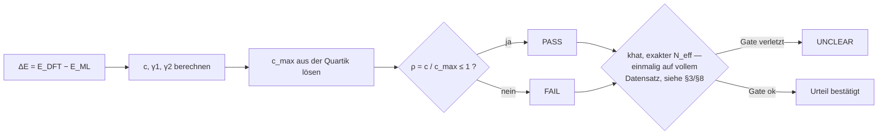

# kish_screening.py

Beantwortet für einen Satz DFT- und ML-Energien eine Frage:

> **Wird thermodynamisches Reweighting auf diesen Daten statistisch tragen — und
> hätte man den teuren Teil der Rechnung früher abbrechen können?**

Eine Datei, nur numpy. Version 1.1.

---

## Quickstart

Kein Beispieldatensatz nötig — das Skript hängt an keinen Projektdaten, ein
Zwei-Zeiler erzeugt synthetische DFT-/ML-Energien und lässt es einmal
komplett durchlaufen:

```bash
python3 -c "
import numpy as np
rng = np.random.default_rng(0)
e_dft = rng.normal(0, 0.01, 500)            # eV, willkuerliche Referenz
e_ml  = e_dft + rng.normal(0, 0.003, 500)   # 'Modell' trifft DFT ungefaehr
np.save('/tmp/e_dft_demo.npy', e_dft)
np.save('/tmp/e_ml_demo.npy', e_ml)
"
python3 kish_screening.py /tmp/e_dft_demo.npy /tmp/e_ml_demo.npy -R 0.8 -T 292
```

Der Modellfehler ist hier klein gegen die Streuung, ein klarer PASS-Fall.
Für den Live-Checkpoint-Modus (§7a), gedacht für wiederholte Aufrufe
während eine Kampagne noch läuft:

```bash
python3 kish_screening.py /tmp/e_dft_demo.npy /tmp/e_ml_demo.npy \
    -N 500 --live -R 0.8 -T 292 -q
```

`tools/live_screening_sim.sh` simuliert diesen Live-Ablauf zusätzlich über
mehrere wachsende Checkpoints hinweg an einem beliebigen eigenen Cache, siehe
Kommentar am Dateianfang.

---

## 1. Die Größe, um die es geht

Reweighting korrigiert Mittelwerte eines ML-Potentials auf DFT-Niveau:

$$\langle A\rangle_\text{DFT} \approx \frac{\sum_i A_i w_i}{\sum_i w_i},
\qquad w_i = e^{-\beta(E_\text{DFT}(R_i)-E_\text{ML}(R_i))}$$

Ob das etwas taugt, hängt daran, wie ungleich die Gewichte werden. Das misst der
**Kish-Wert**

$$\frac{N_\text{eff}}{n} = \frac{(\sum_i w_i)^2}{n\sum_i w_i^2}\ \in (0,1].$$

Bei $N_\text{eff}/n = 0{,}9$ verhält sich die umgewichtete Stichprobe wie 90 %
unabhängiger Punkte. Das Kriterium $N_\text{eff}/n \ge R$ ist **skalenfrei** —
mehr Frames helfen nicht, wenn die Gewichtsverteilung schlecht ist.

---

## 2. Der Formalismus

Mit $\Delta E = \mu + \sigma z$, $z$ standardisiert ($E[z]=0$,
$\mathrm{Var}(z)=1$), wird $w = e^{-\beta\mu}\cdot e^{-cz}$. Der Offset $\mu$
geht nicht mehr ein, übrig bleibt eine einzige Skala:

$$\boxed{c = \beta\,\mathrm{std}(\Delta E)}$$

**Von den Gewichten zum Kish-Wert.** Im Grenzwert $n\to\infty$ werden aus den
Summen Erwartungswerte, $\tfrac1n\sum w_i \to E[w]$ und $\tfrac1n\sum w_i^2
\to E[w^2]$:

$$\frac{N_\text{eff}}{n} = \frac{(\sum w_i)^2}{n\sum w_i^2}
\;\longrightarrow\; \frac{E[w]^2}{E[w^2]}.$$

$e^{-\beta\mu}$ steht in $E[w]$ und $E[w^2]$ nur als Vorfaktor und kürzt sich
im Quadrat des Zählers exakt gegen den Nenner:

$$\frac{E[w]^2}{E[w^2]} = \frac{\big(e^{-\beta\mu}E[e^{-cz}]\big)^2}
{e^{-2\beta\mu}E[e^{-2cz}]} = \frac{E[e^{-cz}]^2}{E[e^{-2cz}]}.$$

Übrig bleibt ein reiner Ausdruck in $c$ und der Verteilung von $z$.

**Kumulantenerzeugende Funktion.** Mit $K(t) := \log E[e^{tz}]$ gilt $\log
E[e^{-cz}] = K(-c)$ und $\log E[e^{-2cz}] = K(-2c)$, also

$$\log\frac{N_\text{eff}}{n} = 2K(-c) - K(-2c).$$

**Entwicklung von $K$.** $K$ ist die Kumulantenerzeugende von $z$,

$$K(t) = \kappa_1 t + \kappa_2\frac{t^2}{2} + \kappa_3\frac{t^3}{6}
+ \kappa_4\frac{t^4}{24} + O(t^5).$$

Für standardisiertes $z$ ist $\kappa_1=0$, $\kappa_2=1$; die dritte und
vierte Kumulante eines standardisierten Merkmals sind per Definition
Schiefe und Exzess-Kurtosis, $\kappa_3=\gamma_1$, $\kappa_4=\gamma_2$:

$$K(t) = \frac{t^2}{2} + \gamma_1\frac{t^3}{6} + \gamma_2\frac{t^4}{24}
+ O(t^5).$$

Einsetzen von $t=-c$ und $t=-2c$:

$$2K(-c) = c^2 - \tfrac{1}{3}\gamma_1 c^3 + \tfrac{1}{12}\gamma_2 c^4
+ O(c^5), \qquad K(-2c) = 2c^2 - \tfrac{4}{3}\gamma_1 c^3
+ \tfrac{2}{3}\gamma_2 c^4 + O(c^5).$$

Die Differenz $2K(-c) - K(-2c)$ liefert die Reihe vollständig:

$$\log\frac{N_\text{eff}}{n} = -c^2 + \gamma_1c^3 - \tfrac{7}{12}\gamma_2c^4
+ O(c^5).$$

Effektiver Entwicklungsparameter ist $2c$, nicht $c$ — $K$ wird auch bei
$t=-2c$ ausgewertet, konvergieren muss also $(2c)$, nicht $c$. Aus der
Restabschätzung $(2c)^5/5! \le 0{,}05$ folgt die Gültigkeitsgrenze
$C_\text{VALID} = \tfrac12(120\cdot0{,}05)^{1/5} \approx 0{,}7155$.

Aufgelöst nach $c$ gibt das Effizienzkriterium die **Schranke** $c_\text{max}$:
die kleinste positive Wurzel von

$$c^2-\gamma_1c^3+\tfrac{7}{12}\gamma_2c^4 = -\ln R,$$

Entschieden wird über das Verhältnis der beiden:

$$\boxed{\rho = \frac{c}{c_\text{max}}}\qquad
\rho \le 1 \Rightarrow \text{PASS},\qquad \rho > 1 \Rightarrow \text{FAIL}$$

$\rho$ ist die eigentliche Kennzahl der Ausgabe. Sie macht Modelle vergleichbar,
deren $c_\text{max}$ wegen unterschiedlicher Schiefe verschieden ausfällt: $c$
allein sagt nichts, solange die Schranke nicht danebensteht.



Das ist der theoretische Kriterium-Pfad aus diesem Abschnitt. Das
Diagnose-Gate und der exakte, annahmefreie Kish-Wert (§3) laufen beide nur
einmal, auf dem vollständigen Datensatz — anders als der sequenzielle
Monitor (§4), der schon auf wachsenden Teilmengen mitläuft. Beide
zusätzlichen Instanzen können strenger entscheiden als $\rho$ allein.

### Die drei Größen und ihre Rollen

| Größe | Rolle | Konvergenz |
|---|---|---|
| $c$ | Skala, Entscheidungsgröße | stabil ab $k\approx14$; $\mathrm{SE}/c=\sqrt{(\gamma_2+2)/4k}$ |
| $\gamma_1,\gamma_2$ | Formkorrektur, bestimmen $c_\text{max}$ | $\gamma_1$ stabil erst ab $k\approx210$ |
| $\hat k$ (Pareto-Tail) | **Existenzbedingung**, Gate — keine Prognose | nur auf dem vollen, geplanten Satz belastbar — nie auf einem Präfix (siehe §7a) |

**Die Genauigkeit von $\gamma_1,\gamma_2$ reicht**, weil über sie nicht
entschieden wird: sie verschieben nur $c_\text{max}$, dort stehen sie als
$\gamma_1c^3$ bzw. $\gamma_2c^4$ gegen den führenden Term $c^2$. Die
Empfindlichkeit ist entsprechend gering, die Unsicherheit wird über Bootstrap
quantifiziert.

**Ein echter Bruch** liegt nur bei sehr kleinem $k$: dort hat die Quartik
gelegentlich gar keine Wurzel im Gültigkeitsbereich, bei $k=5$ in 43 % der
Ziehungen, und $c_\text{max}$ ist dann nicht ungenau, sondern nicht definiert.
Das begründet `k_floor`, nicht die langsame Konvergenz von $\hat\gamma_1$.

**$c$ allein ist kein Prädiktor.** Bei festem $c$ lässt sich $N_\text{eff}/n$
zwischen 0,0007 und 0,99998 konstruieren. Verteilungsfrei gilt nur
$c\to0 \Rightarrow N_\text{eff}/n\to1$. Deshalb zählt nur die schiefenkorrigierte
Kumulantenentwicklung.

**$\hat k$ ist ein Gate, kein Qualitätsmaß.** $E[w^2]<\infty \iff \hat k<0{,}5$.
Ist das verletzt, ist $K(-2c)$ undefiniert und die Herleitung nicht ungenau,
sondern gegenstandslos. $\hat k$ wird deshalb nie auf einem Präfix berechnet,
sondern nur, sobald der volle geplante Satz vorliegt — im Batch-Modus also
immer, im Live-Modus (§7a) erst beim Aufruf, der `n_plan` erreicht, nicht bei
einem früheren FAIL-Abbruch.

---

## 3. Die drei $N_\text{eff}$-Zeilen

| Zeile | Herkunft | Rolle |
|---|---|---|
| **exakt** | $(\sum w)^2/(n\sum w^2)$ über alle $n$ Gewichte | annahmefrei; **allein diese Zahl entscheidet** |
| Reihe | $\exp(-c^2+\gamma_1c^3-\tfrac{7}{12}\gamma_2c^4)$ | Diagnose: trägt die Entwicklung bei diesem $c$? |
| Gauss allein | $\exp(-c^2)$ | zeigt, wie viel die Formkorrektur ausmacht |

Weichen „exakt" und „Reihe" deutlich ab, hält die Entwicklung nicht mehr. Dann
ist $c_\text{max}$ unbrauchbar, der exakte Kish-Wert aber weiterhin gültig. Die
Kumulantenreihe geht **nicht** in das gemeldete $N_\text{eff}/n$ ein; sie liefert
über die Quartik nur die Schranke, gegen die der Monitor vergleicht.

Das gemeldete Restglied $(2c)^5/5! > 0{,}05$ und $c > C_\text{VALID}$ sind
dieselbe Bedingung, nur anders geschrieben.

---

## 4. Der sequenzielle Monitor

Während die Gewichte nach und nach anfallen, wird an einem geometrischen Raster
geprüft:

$$\hat c(k) - \mathrm{SE}\big(\hat c(k)\big)
\;>\;
\hat c_\text{max}(k) + \mathrm{SE}\big(\hat c_\text{max}(k)\big)
\;\Longrightarrow\; \text{FAIL, abbrechen}$$

Drei Eigenschaften, die die Form erklären:

**Einseitig.** Ein frühes PASS spart nichts. Die Gewichte werden am Ende ohnehin
vollständig gebraucht. Nur ein früh abgesichertes FAIL spart Rechenzeit. Damit
bleibt genau eine Fehlerart: ein brauchbares Modell abbrechen.

**Beide Seiten sind laufende Schätzungen.** $\hat c_\text{max}$ streut 30–60 %
stärker als $\hat c$; ein Band nur um $\hat c$ ließe die größere der beiden
Unsicherheiten weg.

**Warum nicht früher geschaut wird.** Der späte Start ist der eigentliche Hebel,
nicht die Rasterdichte: von $k\ge5$ auf $k\ge50$ fällt der Fehlalarm um Faktor 6,
obwohl sich die Zahl der Blicke nur um 11 % verringert. Der Grund ist derselbe
wie bei `k_floor` (§2): bei $k=5$ hat die Quartik oft gar keine Wurzel im
Gültigkeitsbereich.

---

## 5. Konventionen

### ddof

$c$ wird mit `ddof=1` gebildet, $\gamma_1$ und $\gamma_2$ mit `ddof=0`. Das ist
keine Frage der Bibliothek — `ddof` ist eine statistische Wahl, und numpys
eigener Default ist selbst `ddof=0`. Der Grund für die Mischung:

* **$c$ mit `ddof=1`.** Ein Skalenparameter, den man erwartungstreu schätzen will
  — Bessel-Korrektur, beim zweiten Moment exakt.
* **$\gamma_1,\gamma_2$ als Plug-in.** Die Kumulantenentwicklung ist in
  *Populations*kumulanten formuliert; die natürlichen Stichprobenanaloga sind
  $m_3/m_2^{3/2}$ und $m_4/m_2^2-3$. Biaskorrigierte Varianten (Fishers $G_1$,
  $G_2$) schätzen etwas anderes.

Zur Gegenprobe von außen entsprechen $\gamma_1,\gamma_2$ exakt
`scipy.stats.skew`/`kurtosis` mit `bias=True`; das Skript benutzt scipy nicht.
Der Unterschied zwischen den Konventionen ist klein gegen $\mathrm{SE}(c)$ — bei
$n=400$ 0,13 % gegen 3,86 % — aber nicht verschwindend: am ersten Checkpoint bei
$k=50$ beträgt er 1 %, was an der Entscheidungslinie gelegentlich ausreicht.

### Gewichte

$w = e^{-\beta(\Delta E - \min\Delta E)}$. Der Abzug macht den größten Exponenten
exakt null: Überlauf ist ausgeschlossen, möglich bleibt nur Unterlauf der ohnehin
vernachlässigbaren Gewichte. $N_\text{eff}$ ist gegen einen konstanten Offset in
$\Delta E$ invariant, das Ergebnis ändert sich also nicht.

### Die zwei Standardfehler

Sie kommen aus verschiedenen Quellen:

| | Herkunft | Begründung |
|---|---|---|
| $\mathrm{SE}(\hat c)$ | analytisch, $\hat c\sqrt{(\hat\gamma_2+2)/4k}$ | trifft den Bootstrap derselben Sequenz auf 3 % |
| $\mathrm{SE}(\hat c_\text{max})$ | gebootstrappt | die analoge Delta-Methode liegt im Mittel 60 % zu hoch, bei $k=50$ Ausreißer bis Faktor 35 — $f'(c_\text{max})$ steht im Nenner und geht bei verrauschtem $\hat\gamma_1$ gegen null |

Der Bootstrap ist über `--seed` reproduzierbar. Die geschätzte Bandbreite streut
selbst um $1/\sqrt{2B}$ — bei $B=200$ sind das 5 %. Wer knapp an der
Entscheidungsgrenze liegt, nimmt `-B 1000`.

---

## 6. Grenzen

**Die Grauzone um $\rho = 1$ lässt sich nicht wegkalibrieren.** Zur Erinnerung:
$\rho = c/c_\text{max}$, die Grenze liegt bei 1. $\rho=0{,}99$ und $\rho=1{,}01$
unterscheiden sich in $N_\text{eff}/n$ um 0,003. Jede Regel, die $\rho=1{,}05$
erkennt, muss bei $\rho=0{,}95$ gelegentlich feuern — Stetigkeit der
Gütefunktion, kein Umsetzungsfehler.

| Regime | $\rho$ | Verhalten | belastbar? |
|---|---|---|---|
| sicher PASS | $\lesssim0{,}90$ | Fehlalarm $\le0{,}2$ % | **ja** |
| Grauzone | $0{,}95\dots1{,}2$ | Fehlalarm bis 11 %, Erkennung erst 76 % bei $\rho=1{,}1$ | **nein** |
| sicher FAIL | $\gtrsim1{,}2$ | Erkennung 99 %, Abbruch beim ersten Checkpoint | **ja** |

---

## 7. Aufruf

```bash
python3 kish_screening.py DFT_DATEI [ML_DATEI] [Optionen]
```

Welcher Modus greift, entscheidet allein die Zahl der Positionsargumente:

- **Eine Datei (Single-File-Modus):** muss eine `.npz` sein und zwei
  Energie-Keys enthalten — einen für DFT, einen für ML. Die Keys werden
  **genauso** wie im Zwei-Dateien-Modus über `--key-dft` / `--key-ml`
  gesetzt (siehe unten); ohne Angabe sucht das Skript automatisch die
  ersten **zwei unterschiedlichen** Treffer aus derselben Preference-Liste
  (`e_dft, e_mace, e_model, energies, energy, E, e`) — der erste als DFT,
  der nächste als ML. Es wird **kein Ensemble/Committee gemittelt**: es
  wird ein einzelnes Modell erwartet, ein Key mit echter $(M,F)$-Form
  (mehrere Member) führt zum Abbruch (Exit 3). Trivial zweiachsige Arrays
  wie $(n,1)$ werden dagegen einfach geglättet.
- **Zwei Dateien (Zwei-Dateien-Modus):** gelesen werden `.npy .npz .txt .dat
  .csv .tsv`. Bei `.npz` wird der Key über `--key-dft` / `--key-ml` gesetzt;
  ohne Angabe sucht das Skript automatisch den ersten Treffer aus derselben
  Preference-Liste (bzw. den einzigen vorhandenen Key, falls die Datei nur
  einen enthält). Hier wird ein zweiachsiger Treffer (Committee, $(M,F)$)
  weiterhin über Achse 0 gemittelt — DFT- und ML-Energien kommen hier aus
  getrennten Dateien, eine Verwechslung mit einem Committee ist also
  ausgeschlossen.

| Option | Bedeutung | Default |
|---|---|---|
| `-R` | gefordertes $N_\text{eff}/n$ | 0.8 |
| `-T` | Temperatur in Kelvin | 292 |
| `-u` | Einheit der Eingabeenergien | eV |
| `--key-dft` / `--key-ml` | npz-Schlüssel, in **beiden** Modi (siehe oben) | automatische Suche |
| `-k` | Checkpoints unterhalb $k$ verwerfen | 50 |
| `--first-frac` | Rasteranfang als Anteil von $n$ | 0.10 |
| `-b` | Bandbreite in Standardfehlern je Seite | 1.0 |
| `-B` | Bootstrap-Resamples je Checkpoint | 200 |
| `--seed` | Zufallsstartwert | 0 |
| `-N` / `--n-plan` | geplantes Gesamtbudget der Kampagne (siehe §7a) | — |
| `--live` | Live-Checkpoint-Modus, erfordert `-N` (siehe §7a) | aus |
| `--version` | Version ausgeben und beenden | — |

Ausgabeform (`--steps`, `-q`, `--json`, `--no-monitor`) ist eine eigene
Optionsgruppe, siehe Tabelle in §8.

### 7a. Live-Modus — Einbettung in eine laufende MD/DFT-Kampagne

Ohne `--live` geht das Skript von einem **fertigen** Datensatz aus: das
Checkpoint-Raster (§4) wird relativ zur Zahl der übergebenen Punkte gebaut,
und ein Aufruf simuliert die **gesamte** Historie retrospektiv — sinnvoll für
eine einmalige Analyse oder für die Methodenvalidierung
(`analyses/13_sequential_screening/`), aber nicht für wiederholte Aufrufe
während eine MD-Simulation noch läuft: das Raster verschiebt sich mit jedem
neuen Punkt, und jeder Aufruf rechnet die bereits entschiedene Historie samt
Bootstrap neu.

`--live -N n_plan` löst das: `n_plan` ist das geplante Gesamtbudget, unabhängig
davon, wie viele Punkte gerade vorliegen. Das Raster wird relativ zu `n_plan`
gebaut und bleibt über wiederholte Aufrufe mit wachsendem Datensatz stabil.
Ein Aufruf prüft dann **nur den einen gerade fälligen Checkpoint**
(`k = Zahl der übergebenen Punkte`), nicht die Historie:

* `k < k_floor` → `CONTINUE`, kein Check (zu wenige Punkte).
* `k_floor <= k < n_plan` → ein Schritt der Monitor-Regel aus §4 bei diesem
  `k`. Feuert sie → `FAIL` (Exit 1, Kampagne abbrechen). Sonst → `CONTINUE`
  (Exit 0, weiterrechnen). Das $\hat k$-Gate, der exakte Kish-Wert und die
  Restglied-Diagnose werden hier **nicht** geprüft — sie gehören laut §6 ohnehin
  auf den vollständigen Satz, nicht auf die laufende Sequenz.
* `k >= n_plan` → alle geplanten Punkte liegen vor; derselbe Aufruf liefert
  automatisch die volle Zertifizierung wie ohne `--live` (khat, exaktes
  $N_\text{eff}/n$, PASS/FAIL/UNCLEAR).

```bash
# nach jedem neuen DFT-Batch erneut aufrufen, mit den bisher gesammelten Punkten
python3 kish_screening.py e_dft_bisher.npy e_mace_bisher.npy \
    -R 0.8 -T 292 -N 5000 --live -q || {
    echo "FAIL — MD/DFT-Kampagne abbrechen" >&2
    exit 1
}
```

---

## 8. Ergebnisse exportieren

Vier Ausgabeformen, alle auf **stdout**; Warnungen gehen getrennt auf **stderr**
und lassen sich mit `2>/dev/null` unterdrücken, ohne das Ergebnis zu verlieren.

| Form | Aufruf | Inhalt |
|---|---|---|
| Bericht | (Default) | formatierte Kennzahlen und Urteil |
| + Checkpoints | `--steps` | zusätzlich die Tabelle aller Blicke des Monitors |
| Kurzform | `-q` | eine Zeile: `PASS`, `FAIL` oder `UNCLEAR` |
| Maschinenlesbar | `--json` | vollständige Struktur, siehe unten |
| ohne Monitor | `--no-monitor` | nur die Kennzahlen des vollen Satzes |

### JSON-Struktur

```
gesamt/
  n, T, beta, R, units, band          Eingabeparameter
  sigma, c, gamma1, gamma2            Momente von dE
  c_max, c_max_gauss, rho             Schranke und Kennzahl
  neff_ratio                          exakter Kish-Wert  <- entscheidet
  neff_ratio_reihe, neff_ratio_gauss  Vergleichswerte (Diagnose)
  khat, r5                            Gate und Restglied
  k_floor, first_frac, n_plan         Rasterparameter (n_plan nur mit -N)
  diagnose[]                          Meldungen zur Quartik
version                               "1.1"
hinweise[], warnungen[]               Klartextmeldungen
monitor/
  gefeuert                            true/false
  k_stop                              Abbruchpunkt oder null
  gespart                             Anteil eingesparter DFT-Punkte
  checkpoints[]                       das benutzte Raster
  schritte[]                          je Checkpoint: k, c, gamma1, gamma2,
                                      c_max, se_c, se_c_max, abstand, band, feuert
urteil                                "PASS" | "FAIL" | "UNCLEAR" | "CONTINUE"
begruendung                           Klartext
```

Im Live-Modus (`--live`, solange `k < n_plan`) ist `gesamt` schlanker: nur
`n, n_plan, T, beta, R, units, band, k_floor` plus (ab `k >= k_floor`)
`c, gamma1, gamma2, c_max` aus dem einen geprüften Schritt — `sigma`,
`c_max_gauss`, `rho`, `neff_ratio*`, `khat`, `r5`, `diagnose` fehlen, weil sie
dort nicht berechnet werden (§7a). `monitor.schritte` enthält dann genau
einen Eintrag statt des ganzen Rasters. `urteil` ist `"CONTINUE"` oder
`"FAIL"`, nie `"PASS"`/`"UNCLEAR"` — die entscheidet erst der Aufruf bei
`k >= n_plan`.

`schritte[]` enthält $\mathrm{SE}(\hat c)$ und $\mathrm{SE}(\hat c_\text{max})$
**getrennt** — im Bericht steht nur ihre Summe unter „Band". Für die Frage, ob
die Schranke oder die Skala die Unsicherheit dominiert, ist die Aufschlüsselung
nötig.

### Exit-Codes

| Code | Bedeutung |
|---|---|
| 0 | PASS (bzw. im Live-Modus: CONTINUE — kein FAIL bisher, Kampagne fortsetzen) |
| 1 | FAIL |
| 2 | Aufrufsfehler |
| 3 | Datenfehler |
| 4 | UNCLEAR — $\hat k \ge 0{,}5$, $c \ge C_\text{VALID}$, oder die Reihe behauptet an $c_\text{max}$ selbst $N_\text{eff} > n$ |

UNCLEAR wird nur gemeldet, wenn der exakte Kish-Wert nicht ohnehin FAIL sagt — ein
FAIL aus der annahmefreien Zahl steht unabhängig von jeder Reihenentwicklung.
Im Live-Modus kann UNCLEAR (Exit 4) grundsätzlich nicht auftreten, solange
`k < n_plan` — das Gate dafür wird erst bei der vollen Zertifizierung ab
`k >= n_plan` geprüft (§7a).

### Beispiele

```bash
# Kennzahl in eine Variable
rho=$(python3 kish_screening.py daten.npz --json --no-monitor 2>/dev/null \
      | python3 -c "import json,sys; print(json.load(sys.stdin)['gesamt']['rho'])")

# Verlauf der Bänder über die Checkpoints als CSV
python3 kish_screening.py daten.npz --json 2>/dev/null | python3 -c "
import json,sys
print('k,c,c_max,se_c,se_c_max,feuert')
for s in json.load(sys.stdin)['monitor']['schritte']:
    print(f\"{s['k']},{s['c']:.6f},{s['c_max']:.6f},{s['se_c']:.6f},{s['se_c_max']:.6f},{s['feuert']}\")
" > verlauf.csv

# Als Bedingung im Workflow
python3 kish_screening.py daten.npz -q >/dev/null 2>&1 || exit 1
```

---

## 9. Methodik

Der Formalismus ist die auf Modellfehler übertragene Form eines etablierten
Kriteriums: $\beta\sigma_{\Delta U}$ ist in der Freie-Energie-Störungstheorie
seit Zwanzig die Kenngröße für Konvergenz, mit der Faustregel
$\beta\sigma \lesssim 1$. Wu & Kofke (JCP 123, 054103 und 084109, 2005) bauen
darauf ein Bias-Maß über den Phasenraum-Überlapp, allerdings unter Gauß-Annahme —
die $\gamma_1c^3$-Korrektur schließt genau diese Lücke. Kofke (JCP 117, 6911,
2002) leitet strukturell dieselbe Bedingung für die Akzeptanzrate im Replica
Exchange her.

Der $\hat k$-Schätzer folgt Zhang & Stephens (2009) in der Form, die Vehtari
et al. (JMLR 25, 2024) für PSIS benutzen.

Anwendungskontext: Hilpert & Kresse, *Accurate thermophysical properties of water
using machine-learned potentials*, J. Chem. Phys. 164, 194504 (2026).
