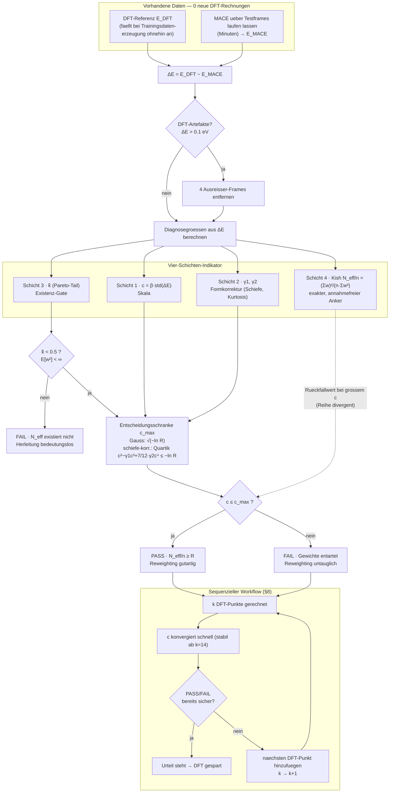

```mermaid
flowchart TD
    subgraph IN["Vorhandene Daten — 0 neue DFT-Rechnungen"]
        A["DFT-Referenz E_DFT<br/>(faellt bei Trainingsdaten-<br/>erzeugung ohnehin an)"]
        B["MACE ueber Testframes laufen lassen<br/>(Minuten) → E_MACE"]
    end

    A --> C["ΔE = E_DFT − E_MACE"]
    B --> C

    C --> D{"DFT-Artefakte?<br/>ΔE > 0.1 eV"}
    D -->|"ja"| D1["4 Ausreisser-Frames entfernen"]
    D -->|"nein"| E
    D1 --> E["Diagnosegroessen aus ΔE berechnen"]

    subgraph DIAG["Vier-Schichten-Indikator"]
        direction TB
        S1["Schicht 1 · c = β·std(ΔE)<br/>Skala"]
        S2["Schicht 2 · γ1, γ2<br/>Formkorrektur (Schiefe, Kurtosis)"]
        S3["Schicht 3 · k̂ (Pareto-Tail)<br/>Existenz-Gate"]
        S4["Schicht 4 · Kish N_eff/n = (Σw)²/(n·Σw²)<br/>exakter, annahmefreier Anker"]
    end

    E --> S1
    E --> S2
    E --> S3
    E --> S4

    S3 --> G{"k̂ < 0.5 ?<br/>E[w²] < ∞"}
    G -->|"nein"| FAILX["FAIL · N_eff existiert nicht<br/>Herleitung bedeutungslos"]

    G -->|"ja"| H["Entscheidungsschranke c_max<br/>Gauss: √(−ln R)<br/>schiefe-korr.: Quartik c²−γ1c³+7/12·γ2c⁴ ≤ −ln R"]
    S1 --> H
    S2 --> H

    H --> J{"c ≤ c_max ?"}
    J -->|"ja"| PASS["PASS · N_eff/n ≥ R<br/>Reweighting gutartig"]
    J -->|"nein"| FAILD["FAIL · Gewichte entartet<br/>Reweighting untauglich"]

    S4 -.->|"Rueckfallwert bei grossem c<br/>(Reihe divergent)"| J

    subgraph SEQ["Sequenzieller Workflow (§8)"]
        direction TB
        Q0["k DFT-Punkte gerechnet"]
        Q1["c konvergiert schnell (stabil ab k≈14)"]
        Q2{"PASS/FAIL<br/>bereits sicher?"}
        Q2 -->|"ja"| Q3["Urteil steht → DFT gespart"]
        Q2 -->|"nein"| Q4["naechsten DFT-Punkt hinzufuegen<br/>k → k+1"]
        Q0 --> Q1 --> Q2
        Q4 --> Q0
    end

    PASS --> Q0
    FAILD --> Q0
```
