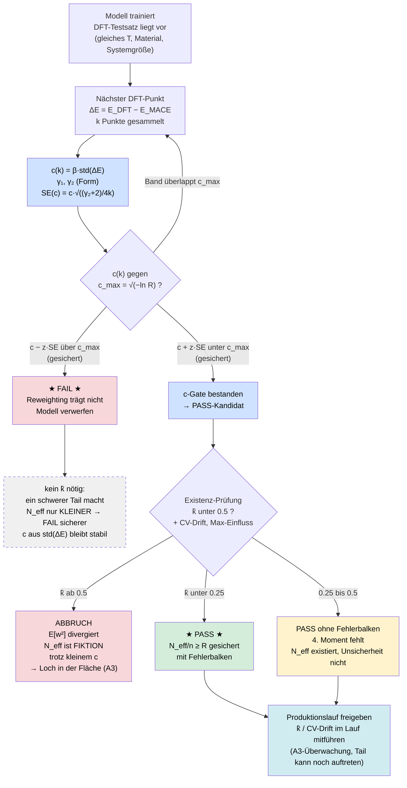

# Sequenzielles Screening — Workflow-Map

Aktueller Stand des Entscheidungsflusses aus Analyse 13. Kernpunkt gegenüber der
früheren Fassung: **$\hat k$ ist von einem Vorschalt-Gate zu einer Nachprüfung nur auf
dem PASS-Zweig geworden** — begründet durch die Monotonie von $N_\text{eff}$ in der
Tail-Schwere.

---

## Die Logik in Kurzform

**Der Fluss hat zwei Gates, aber sie sind nicht gleichwertig.**

1. **c-Gate (immer).** $c(k)$ gegen $c_\text{max} = \sqrt{-\ln R}$, mit einseitigem
   $z$-Band gegen den Stichprobenfehler. Entscheidet PASS-Kandidat / FAIL / weiterrechnen.
   Konvergiert schnell (stabil ab $k\approx14$), deshalb steht das Urteil für klare Fälle
   nach ~15 Punkten.

2. **k̂-Gate (nur PASS-Zweig).** Erst wenn das c-Gate grünes Licht gibt, wird geprüft, ob
   $N_\text{eff}$ überhaupt existiert. Denn ein kleines $c$ schließt einen schweren
   Gewichts-Tail **nicht** aus — $c$ und $\hat k$ sind entkoppelt.

**Warum die Asymmetrie.** $N_\text{eff}/n$ fällt monoton mit der Tail-Schwere
(Cauchy–Schwarz). Ein Tail kann das wahre $N_\text{eff}$ also nur **verkleinern**:

- auf dem **FAIL-Zweig** verstärkt das die Entscheidung — $\hat k$ überflüssig;
- auf dem **PASS-Zweig** kann es sie umkehren (falsches PASS) — $\hat k$ nötig.

Zusätzlich ist $c$ selbst robust, weil es aus $\mathrm{std}(\Delta E)$ kommt (Rumpf,
endliche Varianz), nicht aus $w$ (schwerer Tail möglich). Ein FAIL steht damit auch dann
fest, wenn $N_\text{eff}$ gar nicht existiert.

---

## Was die Gates NICHT leisten

| Gate | prüft | prüft **nicht** |
|---|---|---|
| c-Gate | ist der Rumpf von ΔE schmal genug? | — |
| k̂-Gate | hat die **beobachtete** Stichprobe einen tragbaren Tail? | ob ein **ungesehener** Frame den Tail sprengt |

Die zweite Spalte ist die Abdeckungsfrage **A3**. Sie ist am Testsatz strukturell nicht
lösbar (die gefährlichen Konfigurationen sind selten und fehlen), sondern gehört an die
**Produktionstrajektorie** — laufendes $\hat k$ oder, billiger, CV-Drift und Max-Einfluss
über die 5000 Frames. Deshalb der Knoten „A3-Überwachung" nach der Freigabe.

---

## Verankerung im Gesamtprojekt

Dieser Fluss ist die sequenzielle, iterativ getestete Variante des Screenings aus
`notebooks/map.md`. Die dortigen Annahmen gelten weiter:

- **A1** (Ensemble-Transfer Testsatz → Produktion, `notebooks/ensemble_korrektur.md`) —
  hier nicht dargestellt, weil die Analyse die $\Delta E$ direkt auf dem Testsatz nimmt;
  im echten Einsatz käme die +8.7-%-Korrektur zwischen „ΔE" und „c(k)".
- **A2** (Konvergenz der Kumulantenreihe) — der Grund, warum die $N_\text{eff}$-Prognose
  aus $c$ für die L0-Modelle 6–17 % danebenliegt, für die Entscheidung aber egal ist.
- **A3** (Abdeckung) — der Knoten „A3-Überwachung" oben.
